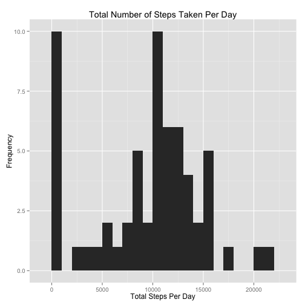
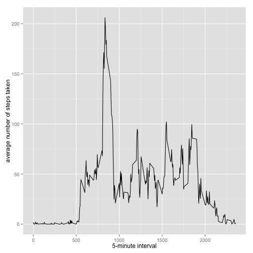
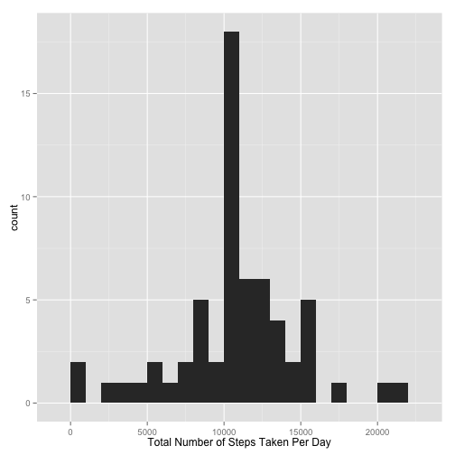
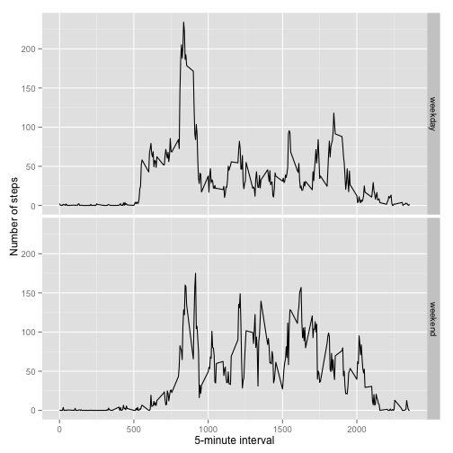

#Reproducible Research: Peer Assessment 1  
## Loading and preprocessing the data  
- Unzip the data in which are in the zip file; read the csv file to the memory and summary the entire data.  


```r
        if(!file.exists('activity.csv')){
                unzip('activity.zip')
        }

        activity <- read.csv(file = "activity.csv",colClasses = c("integer", "Date", "integer"))
        summary(activity)
```

```
##      steps             date               interval     
##  Min.   :  0.00   Min.   :2012-10-01   Min.   :   0.0  
##  1st Qu.:  0.00   1st Qu.:2012-10-16   1st Qu.: 588.8  
##  Median :  0.00   Median :2012-10-31   Median :1177.5  
##  Mean   : 37.38   Mean   :2012-10-31   Mean   :1177.5  
##  3rd Qu.: 12.00   3rd Qu.:2012-11-15   3rd Qu.:1766.2  
##  Max.   :806.00   Max.   :2012-11-30   Max.   :2355.0  
##  NA's   :2304
```
## What is mean total number of steps taken per day?    
- calculate the total number of steps taker per day and plot the histogram  


```r
        library(ggplot2)
        steps.per.day <- tapply(activity$steps, activity$date, FUN=sum, na.rm = TRUE)
        qplot(steps.per.day, binwidth = 1000, main = "Total Number of Steps Taken Per Day", xlab = "Total Steps Per Day", ylab = "Frequency")   
```

 

```r
        mean(steps.per.day, na.rm = TRUE)
```

```
## [1] 9354.23
```

```r
        median(steps.per.day, na.rm = TRUE)
```

```
## [1] 10395
```
## What is the average daily activity pattern?  

```r
        library(ggplot2)
        averages <- aggregate(x=list(steps=activity$steps), by=list(interval=activity$interval),
                              FUN=mean, na.rm=TRUE)
        ggplot(data=averages, aes(x=interval, y=steps)) +
                geom_line() +
                xlab("5-minute interval") +
                ylab("average number of steps taken")
```

 

```r
        averages[which.max(averages$steps),]
```

```
##     interval    steps
## 104      835 206.1698
```
## Imputing missing values  
1. Calculate and report the total number of missing values in the dataset (i.e. the total number of rows with NAs)  

```r
        missing.values <- length(which(is.na(activity$steps)))
```
Number of the missing values are   

```r
        print(missing.values)
```

```
## [1] 2304
```
2. Devise a strategy for filling in all of the missing values in the dataset. The strategy does not need to be sophisticated. For example, you could use the mean/median for that day, or the mean for that 5-minute interval, etc.  

3. Create a new dataset that is equal to the original dataset but with the missing data filled in.  

```r
        library(Hmisc)
        activityimputed <- activity
        activityimputed$steps <- impute(activity$steps, fun=mean)
```

```r
        any(is.na(activityimputed$steps))
```

```
## [1] FALSE
```
4. Make a histogram of the total number of steps taken each day and Calculate and report the mean and median total number of steps taken per day. Do these values differ from the estimates from the first part of the assignment? What is the impact of imputing missing data on the estimates of the total daily number of steps?  

```r
        activityimputed <- tapply(activityimputed$steps, activityimputed$date, FUN=sum)
        qplot(activityimputed, binwidth=1000, xlab="Total Number of Steps Taken Per Day")
```

 

```r
        mean(activityimputed)
```

```
## [1] 10766.19
```

```r
        median(activityimputed)
```

```
## [1] 10766.19
```
## Are there differences in activity patterns between weekdays and weekends?
1. Create a new factor variable in the dataset with two levels – “weekday” and “weekend” indicating whether a given date is a weekday or weekend day.  

```r
dateType <- function(date) {
    day <- weekdays(date)
    if (day %in% c("Monday", "Tuesday", "Wednesday", "Thursday", "Friday"))
        return("weekday")
    else if (day %in% c("Saturday", "Sunday"))
        return("weekend")
    else
        stop("invalid date")
}
activity$date <- as.Date(activity$date)
activity$day <- sapply(activity$date, FUN=dateType)
```

2. Make a panel plot containing a time series plot (i.e. type = "l") of the 5-minute interval (x-axis) and the average number of steps taken, averaged across all weekday days or weekend days (y-axis). See the README file in the GitHub repository to see an example of what this plot should look like using simulated data.


```r
averagedsteps <- aggregate(steps ~ interval + day, data=activity, mean)
ggplot(averagedsteps, aes(interval, steps)) + geom_line() + facet_grid(day ~ .) +
    xlab("5-minute interval") + ylab("Number of steps")
```

 

